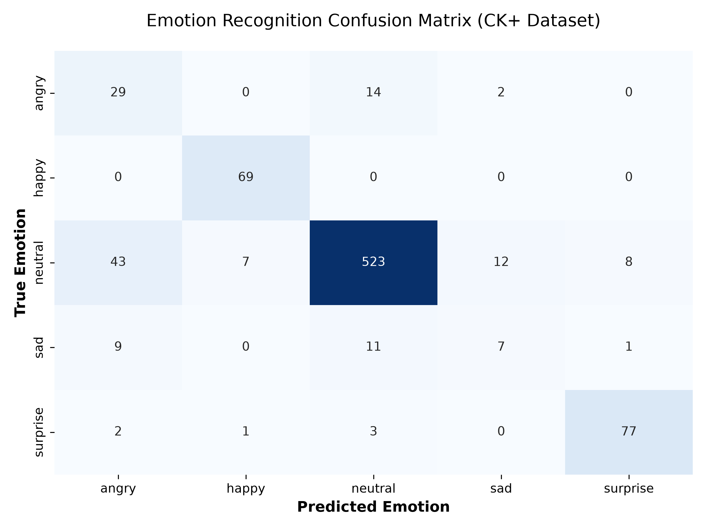
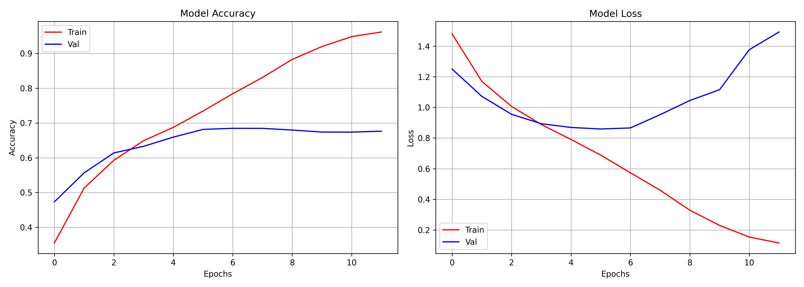

# Facial Emotion Recognition

This is my personal deep learning project to detect and classify human emotions from facial images.

## My Process

1. **Data Collection & Training:**
   I started by collecting the **FER-2013** dataset. I used its training set to train my Convolutional Neural Network (CNN), and its test set as my **validation test** set during the training process to monitor for overfitting.
   
2. **Model Architecture:**
   I built a deep CNN architecture with multiple `Conv2D` layers (blocks of 64, 128, 256, and 512 filters) coupled with `MaxPooling2D` layers to extract facial features. The dense layers at the end classify these features into one of 5 emotions: `angry`, `happy`, `neutral`, `sad`, or `surprise`.
   
3. **External Testing & Validation:**
   After training my model on the FER-2013 dataset, I wanted to see how well it generalized to completely unseen data. So, I used the **CK+ dataset** (Extended Cohn-Kanade) to run a final test on the model.

## Results & Performance

When evaluating the model on the unseen CK+ dataset, the model achieved an impressive **86.19% accuracy**!

Here is the **Confusion Matrix** showing exactly where the model succeeded and where it got confused (for example, it is incredibly accurate at predicting 'happy' and 'neutral', but struggles slightly with 'sad' faces being confused for 'angry' or 'neutral'):



And here are the **Performance Metrics** showing the accuracy and loss curves during the actual training phase on FER-2013:



---

## How to Run This Project

If I need to run this locally again, here are my minimal steps:

### 1. Activate Environment
Ensure the virtual environment is active:
```bash
.\.venv\Scripts\activate
```

### 2. Train the Model
To re-train the CNN model from scratch (reading from `data/train` and `data/validation_test`):
```bash
python src/models/train_model.py
```
*(This will automatically save the best model to `models/emotion_model.keras` and output the performance plots).*

### 3. Evaluate the Model (CK+ Dataset)
To run the full evaluation suite against the CK+ test CSV and generate the confusion matrix:
```bash
python src/models/evaluate_model.py
```

### 4. Test on a Single Image
To test how the model performs on a sample photo (put the image in `data/test/`):
```bash
python src/predict_emotion.py
```
